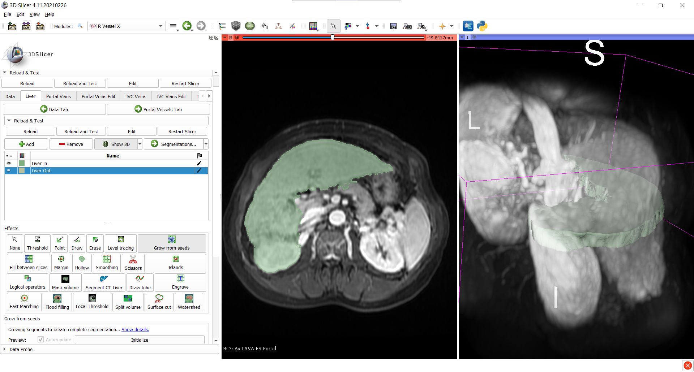
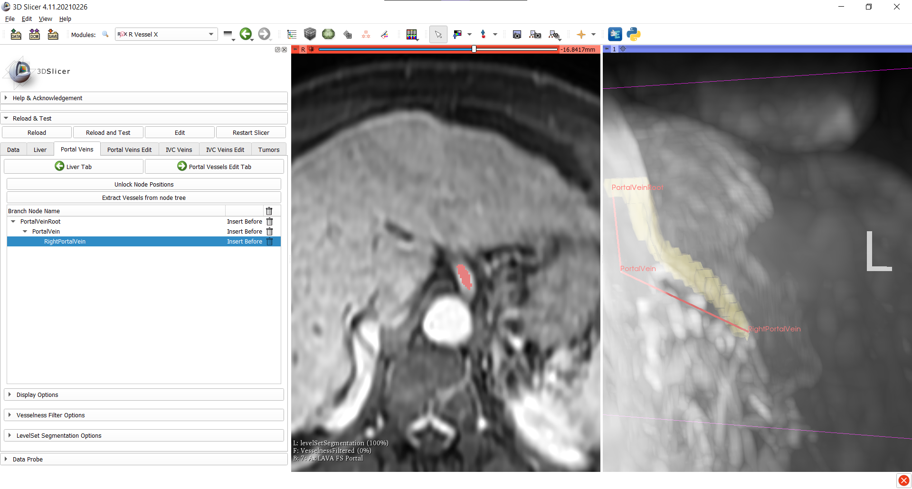

# Summary

Annotation plays a key role in the creation of reference datasets that are useful to evaluate medical image processing algorithms and to train machine learning based architectures. `RVXLiverSegmentation` is a `3D Slicer` [@3DSlicer2020-Web;@Kikinis2014-3DSlicer] plug-in aiming at speeding-up the annotation of liver anatomy from medical images (CT scans or MRI for intance). This organ has a complex and particular geometry; within its parenchymal volume, the liver receives blood from the portal vein and hepatic artery (the former one being the most visible in medical images), and delivers filtered blood through the hepatic veins, toward inferior vena cava. The blood vessels subdivide into the liver as fine vascular tree structures, which make the segmentation difficult, mostly in MRI modality. `RVXLiverSegmentation` can be downloaded from [@plugin] or installed from the `3D Slicer` software as an official module. To facilitate this task, our plug-in is decomposed into modules devoted to the segmentation of the liver volume, inner vessels and possible tumors. 

# Statement of need

For research purpose, needing annotation of liver anatomy from medical images, the `RVXLiverSegmentation` provides 7 main tabs:

* loading and managing medical imaging data;
* liver segmentation;
* portal veins annotation and segmentation;
* edit portal veins segmentation;
* inferior vena cava annotation and segmentation;
* edit inferior vena cava segmentation;
* tumor segmentation. 

Once the medical image data is loaded into the `3D Slicer` interface, the liver can be segmented with the associated tab, either by using interactive tools (such as region growing approaches) or by an automatic deep learning based algorithm (for CT scans only), as exposed in Figure \autoref{fig:liver_tab}. 
Then, the reconstructions of hepatic vessels (portal vein and inferior vena cava) are based on tree structures interactively built by the user, who places the nodes of important branches and bifurcations (with specific anatomical nomenclature) into the scene of the medical image to be processed. After this step, a VMTK (Vascular Modeling Tool Kit) [@a2008-VMTK] module segments the vessels by using those graphs as initialization patterns (see Figure \autoref{fig:portal_vein_tab}). The last tab allows the user to segment interactively possible tumoral tissues with dedicated tools.  
This tab also permits to export the complete scene, comprising:

* segmentation label maps (liver, inferior vena cava, portal vein, tumors);
* portal vein and inferior vena cava intersection positions (fiducial CSV and adjacency matrix);
* the complete scene as a MRB file. 

{ width=70% }

{ width=70% }

# Preliminary results obtained with the plug-in 

A first version of the `RVXLiverSegmentation` has been employed for segmenting livers from dynamic-contrast enhanced MRI data to test and evaluate a combined registration-segmentation algorithm, described in [@Debroux2020-IPTA]. We have also compared the time and quality of segmentations obtained by `RVXLiverSegmentation` and by embedded image processing tool `General Electric AW` solution (Server 3.2). Our first results [@Lamy2020-VPH] have shown a real speed-up in the segmentation of liver volume and inner vessels: 

* for healthy patients: 
  - livers segmented in 3 minutes with `RVXLiverSegmentation`; 10 minutes with `General Electric AW`
  - vessels segmented in 5 minutes with `RVXLiverSegmentation`; 30 minutes with `General Electric AW`
* for patients suffering from cirrhosis:
  - livers segmented in 4 minutes with `RVXLiverSegmentation`; 15 minutes with `General Electric AW`
  - vessels segmented in 7 minutes with `RVXLiverSegmentation`; 45 minutes with `General Electric AW`

These averaged times were measured with a first cohort of 6 "healthy" patients (*i.e.* not suffering from any hepatic disease) and 4 patients with liver cancer and cirrhosis. 

# Future works

We first would like to integrate advanced deep learning models for liver and hepatic vessels segmentation [@Affane2021-MDPI] into our `RVXLiverSegmentation` plug-in, in order to provide automatic reconstrutions that can be then edited by the user with the other tools proposed in the plug-in and in `3D Slicer`. Another important work concerns the VMTK module, which needs more adaptations to MRI processing. As an example, the Frangi filter is employed as a pre-processing step (as a vascular enhancement algorithm), while other approaches could be opted instead [@Lamy2020-ICPR]. Finally, a more complete evaluation protocol will be conducted with our plug-in, compared to commercial solutions, by taking into account more patient cohorts.  

# Acknowledgements

This work was funded by the French \emph{Agence Nationale de la Recherche} (grant ANR-18-CE45-0018, project R-Vessel-X, http://tgi.ip.uca.fr/r-vessel-x). 

# References